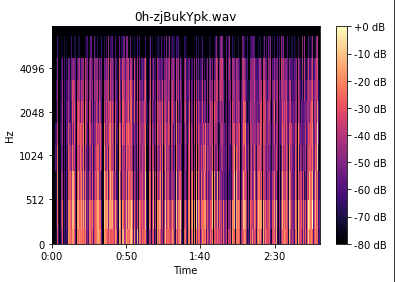

# BU-SocialSentiment583

### Table of Contents

- [Description](#description)
- [How To Use](#how-to-use)

- [My Information](#My-Information)

---

## Description

A social sentiment analysis project using Juypter Notebook to better understand signals and classify them into negative, positive or neutral

#### Technologies

- Tensorflow
- Node
- Librosa
- Jupyter Notebook 
- Python
- MatplotLib
- Numpy 
- Pandas
- Keras

[Back To The Top](#Portfolio)

---

## My Information

 

[Back To The Top](#4Hour-Fruit-Shop-Website-Coding-Challenge)
